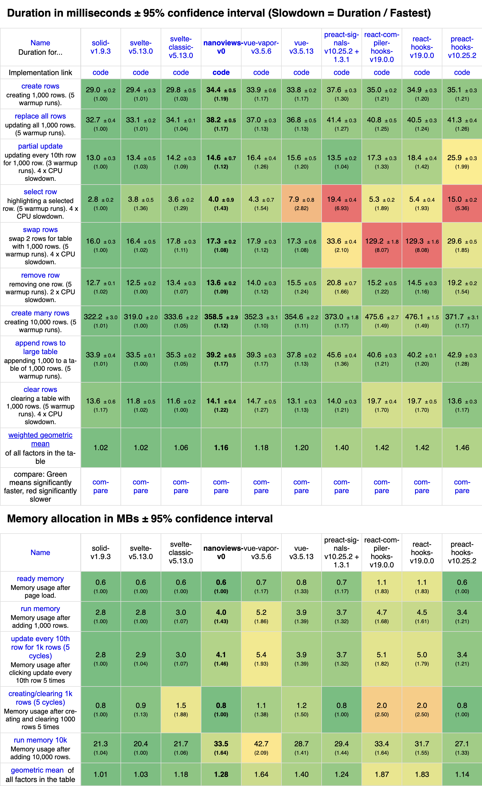

# nanoviews

[![ESM-only package][package]][package-url]
[![NPM version][npm]][npm-url]
[![Dependencies status][deps]][deps-url]
[![Install size][size]][size-url]
[![Build status][build]][build-url]
[![Coverage status][coverage]][coverage-url]

[package]: https://img.shields.io/badge/package-ESM--only-ffe536.svg
[package-url]: https://nodejs.org/api/esm.html

[npm]: https://img.shields.io/npm/v/nanoviews.svg
[npm-url]: https://npmjs.com/package/nanoviews

[deps]: https://img.shields.io/librariesio/release/npm/nanoviews
[deps-url]: https://libraries.io/npm/nanoviews

[size]: https://deno.bundlejs.com/badge?q=nanoviews
[size-url]: https://bundlejs.com/?q=nanoviews

[build]: https://img.shields.io/github/actions/workflow/status/TrigenSoftware/nanoviews/tests.yml?branch=main
[build-url]: https://github.com/TrigenSoftware/nanoviews/actions

[coverage]: https://img.shields.io/codecov/c/github/TrigenSoftware/nanoviews.svg
[coverage-url]: https://app.codecov.io/gh/TrigenSoftware/nanoviews

<picture>
  <source media="(prefers-color-scheme: dark)" srcset="../../assets/moon_white.svg">
  
</picture>

A small Direct DOM library for creating user interfaces.

- **Small**. Between 3.5 and 7 kB (minified and brotlied). Zero external dependencies[*](#reactivity).
- **Direct DOM**. Less CPU and memory usage compared to Virtual DOM.
- Designed for best **Tree-Shaking**: only the code you use is included in your bundle.
- **TypeScript**-first.

```js
import { signal } from 'nanoviews/store'
import { div, a, img, h1, button, p, mount } from 'nanoviews'

function App() {
  const $counter = signal(0)

  return div()(
    a({ href: 'https://vitejs.dev', target: '_blank' })(
      img({ src: './vite.svg', class: 'logo', alt: 'Vite logo' })
    ),
    a({ href: 'https://github.com/TrigenSoftware/nanoviews', target: '_blank' })(
      img({ src: './nanoviews.svg', class: 'logo nanoviews', alt: 'Nanoviews logo' })
    ),
    h1()('Vite + Nanoviews'),
    div({ class: 'card' })(
      button({
        onClick() {
          $counter($counter() + 1)
        }
      })(
        'count is ', $counter
      )
    ),
    p({ class: 'read-the-docs' })('Click on the Vite and Nanoviews logos to learn more')
  )
}

mount(App, document.querySelector('#app'))
```

<hr />
<a href="#install">Install</a>
<span>&nbsp;&nbsp;•&nbsp;&nbsp;</span>
<a href="#reactivity">Reactivity</a>
<span>&nbsp;&nbsp;•&nbsp;&nbsp;</span>
<a href="#basic-markup">Basic markup</a>
<span>&nbsp;&nbsp;•&nbsp;&nbsp;</span>
<a href="#effect-attributes">Effect attributes</a>
<span>&nbsp;&nbsp;•&nbsp;&nbsp;</span>
<a href="#components">Components</a>
<span>&nbsp;&nbsp;•&nbsp;&nbsp;</span>
<a href="#control-flow">Control flow</a>
<span>&nbsp;&nbsp;•&nbsp;&nbsp;</span>
<a href="#special-methods">Special methods</a>
<span>&nbsp;&nbsp;•&nbsp;&nbsp;</span>
<a href="#why">Why?</a>
<br />
<hr />

## Install

```bash
pnpm add nanoviews
# or
npm i nanoviews
# or
yarn add nanoviews
```

## Reactivity

Nanoviews is using [Kida](https://github.com/TrigenSoftware/nano_kit/tree/main/packages/kida) under the hood for reactivity. Kida is a signal library inspired by [Nano Stores](https://github.com/nanostores/nanostores) and was build specially for Nanoviews.

```js
import { signal } from 'nanoviews/store' // or import { signal } from 'kida'
import { fragment, input, p } from 'nanoviews'

const $text = signal('')

fragment(
  input({
    onInput(event) {
      $text(event.target.value)
    }
  }),
  p()($text)
)
```

Basicly, under the hood, reactivity works something like that:

```ts
import { signal, effect } from 'kida'

const $text = signal('')
const textNode = document.createTextNode('')

effect(() => {
  textNode.data = $text()
})
```

## Basic markup

Nanoviews provides a set of methods for creating HTML elements with the specified attributes and children. Every method creates a DOM node.

Child can be an another DOM node, primitive value (string, number, boolean, `null` or `undefined`) or signal with primitive. Attributes also can be a primitive value or signal.

```js
import { signal } from 'nanoviews/store'
import { ul, li } from 'nanoviews'

const $boolean = signal(true)
const list = ul({ class: 'list' })(
  li()('String value'),
  li()('Number value', 42),
  li()('Boolean value', $boolean)
)
// `list` is HTMLUListElement instance
```

### mount

`mount` is a method that mounts the component to the specified container.

```js
import { signal } from 'nanoviews/store'
import { div, h1, p, mount } from 'nanoviews'

function App() {
  return (
    div()(
      h1()('Nanoviews App'),
      p()('Hello World!')
    )
  )
}

mount(App, document.querySelector('#app'))
```

## Effect attributes

Effect attributes are special attributes that can control element's behavior.

### ref$

`ref$` is an effect attribute that can provide a reference to the DOM node.

```js
import { signal } from 'nanoviews/store'
import { div, ref$ } from 'nanoviews'

const $ref = signal(null)

div({
  [ref$]: $ref
})(
  'Target element'
)
```

### style$

`style$` is an effect attribute that manages the style of the element.

```js
import { signal } from 'nanoviews/store'
import { button, style$ } from 'nanoviews'

const $color = signal('white')

button({
  [style$]: {
    color: $color,
    backgroundColor: 'black'
  }
})(
  'Click me'
)
```

### classList$

`classList$` is an effect attribute that manages the class list of the element. It accepts an array of parts: every truthy string is joined with spaces into the `class` attribute, everything else is dropped.

```js
import { signal } from 'nanoviews/store'
import { button, classList$ } from 'nanoviews'

const $primary = signal(true)

button({
  [classList$]: [
    'button',
    () => $primary() && 'primary'
  ]
})(
  'Click me'
)
// <button class="button primary">Click me</button>
```

Parts can be static or reactive. `classList$` writes the whole `class` attribute, so use either `class` or `classList$` on an element, not both.

### autoFocus$

`autoFocus$` is an effect attribute that sets the auto focus on the element.

```js
import { input, autoFocus$ } from 'nanoviews'

input({
  type: 'text',
  [autoFocus$]: true
})
```

### value$

`value$` is an effect attribute that manages the value of text inputs.

```js
import { signal } from 'nanoviews/store'
import { textarea, value$ } from 'nanoviews'

const $review = signal('')

textarea({
  name: 'review',
  [value$]: $review
})(
  'Write your review here'
)
```

### checked$

`checked$` is an effect attribute that manages the checked state of checkboxes and radio buttons.

```js
import { signal } from 'nanoviews/store'
import { input, checked$, Indeterminate } from 'nanoviews'

const $checked = signal(false)

input({
  type: 'checkbox',
  [checked$]: $checked
})
```

Also you can manage [indeterminate state of checkboxes](https://developer.mozilla.org/en-US/docs/Web/HTML/Element/input/checkbox#indeterminate_state_checkboxes):

```js
$checked(Indeterminate)
```

### selected$

`selected$` is an effect attribute that manages the selected state of select's options.

```js
import { signal } from 'nanoviews/store'
import { select, option, selected$ } from 'nanoviews'

const $selected = signal('mid')

select({
  name: 'player-pos',
  [selected$]: $selected
})(
  option({
    value: 'carry'
  })('Yatoro'),
  option({
    value: 'mid'
  })('Larl'),
  option({
    value: 'offlane'
  })('Collapse'),
  option({
    value: 'support'
  })('Mira'),
  option({
    value: 'full-support'
  })('Miposhka')
)
```

Multiple select:

```js
const $selected = signal(['mid', 'carry'])

select({
  name: 'player-pos',
  [selected$]: $selected
})(
  option({
    value: 'carry'
  })('Yatoro'),
  option({
    value: 'mid'
  })('Larl'),
  option({
    value: 'offlane'
  })('Collapse'),
  option({
    value: 'support'
  })('Mira'),
  option({
    value: 'full-support'
  })('Miposhka')
)
```

### files$

`files$` is an effect attribute that can provide the files of file inputs.

```js
import { signal } from 'nanoviews/store'
import { input, files$ } from 'nanoviews'

const $files = signal([])

input({
  type: 'file',
  [files$]: $files
})
```

### createEffectAttribute

The effect attributes above are built with `createEffectAttribute`, and so can yours. It takes an id and a handler that receives the element and the value, and returns the id to use as a computed key. The handler runs inside the element's effect scope, so an `effect` in it is torn down with the element.

```js
import { $get, effect } from 'nanoviews/store'
import { createEffectAttribute } from 'nanoviews'

export const title$ = createEffectAttribute('title$', (element, $value) => {
  effect(() => {
    element.title = $get($value)
  })
})
```

To make it typed at the call site, register it by augmenting the `nanoviews` module — `EffectAttributeValues` declares what the attribute accepts, `EffectAttributeTargets` which elements it applies to:

```ts
declare module 'nanoviews' {
  interface EffectAttributeValues<Target extends Element> {
    title$: Signalish<string>
  }

  interface EffectAttributeTargets {
    title$: HTMLElement
  }
}
```

```js
import { signal } from 'nanoviews/store'
import { div } from 'nanoviews'

const $title = signal('Hello')

div({
  [title$]: $title
})(
  'Hover me'
)
```

## Components

Components are the building blocks of any application. These units are reusable and can be combined to create more complex applications.

Components are functions that return primitive or DOM node:

```ts
function MyComponent() {
  return div()('Hello, Nanoviews!')
}
```

### props$

`props$` is a method that adds a `$`-prefixed accessor twin to every prop. `title` is the prop as it arrived, `$title` is the same prop in accessor form: the prop itself when it already is a signal or an accessor, a wrapper when it is a static value, and `undefined` when the prop is not set, so a destructuring default can fill it in.

A prop read as `$title` leaves the rest, so `...restProps` carries exactly the props the component did not take, in the form they arrived in, straight onto an element:

```js
import { button, props$, classList$ } from 'nanoviews'

function Button(props) {
  const {
    $size = () => 'm',
    ...restProps
  } = props$(props)

  return (
    button({
      ...restProps,
      [classList$]: [
        'button',
        () => `button_${$size()}`
      ]
    })(
      'Send'
    )
  )
}

Button({ title: 'Send it', size: 's', id: 'send' })
// <button title="Send it" id="send" class="button button_s">Send</button>
```

### effect

`effect` is a method that add effects to the component.

```js
import { div, effect } from 'nanoviews'

function MyComponent() {
  effect(() => {
    console.log('Mounted')

    return () => {
      console.log('Unmounted')
    }
  })

  return div()('Hello, Nanoviews!')
}
```

Also you can use `effect` with signals:

```js
import { signal } from 'nanoviews/store'
import { div, effect } from 'nanoviews'

const $timeout = signal(1000)

function MyComponent() {
  let intervalId

  effect(() => {
    intervalId = setInterval(() => {
      console.log('Tick')
    }, $timeout())

    return () => {
      clearInterval(intervalId)
    }
  })

  return div()('Hello, Nanoviews!')
}
```

### children$

`children$` is a method that creates optional children receiver.

```js
import { div, children$ } from 'nanoviews'

function MyComponent(props) {
  return children$(children => (
    div(props)(
      'My component children: ',
      ...children?.length ? children : ['empty']
    )
  ))
}

MyComponent() // <div>My component children: empty</div>

MyComponent()('Hello, Nanoviews!') // <div>My component children: Hello, Nanoviews!</div>
```

### slots$

`slots$` is a method to receive slots and rest children.

```js
import { main, header, footer, children$, slot$, slots$ } from 'nanoviews'

function LayoutHeader(props) {
  return children$(children => slot$(LayoutHeader, (
    header(props)(
      ...children
    )
  )))
}

function LayoutFooter(props) {
  return children$(children => slot$(LayoutFooter, (
    footer(props)(
      ...children
    )
  )))
}

function Layout() {
  return slots$(
    [LayoutHeader, LayoutFooter],
    (headerSlot, footerSlot, children) => main()(
      headerSlot,
      ...children,
      footerSlot
    )
  )
}

Layout()(
  LayoutHeader({
    'data-testid': 'header'
  })(
    'Header content'
  ),
  LayoutFooter({
    'data-testid': 'footer'
  })(
    'Footer content'
  ),
  'Main content'
)
// <main><header data-testid="header">Header content</header>Main content<footer data-testid="footer">Footer content</footer></main>
```

Slot's content can be anything, including functions, that can be used to render lists:

```js
import { ul, li, b, slot$, slots$, for_ } from 'nanoviews'

function ListItem(renderItem) {
  return slot$(ListItem, renderItem)
}

function List(items) {
  return slots$(
    [ListItem],
    listItemSlot => ul()(
      for_(items)(
        item => li()(
          listItemSlot(item.name)
        )
      )
    )
  )
}

List([
  { id: 0, name: 'chopper' },
  { id: 1, name: 'magixx' },
  { id: 2, name: 'zont1x' },
  { id: 3, name: 'donk' },
  { id: 4, name: 'sh1ro' },
  { id: 5, name: 'hally' }
])(
  ListItem(name => b()('Player: ', name))
)
```

### context

`context` is a method that can provide a context to the children.

```js
import { signal } from 'nanoviews/store'
import { div, context, provide, inject } from 'nanoviews'

function ThemeContext() {
  return signal('light') // default value
}

function MyComponent() {
  const $theme = inject(ThemeContext)

  return (
    div()(
      'Current theme: ',
      $theme
    )
  )
}

function App() {
  const $theme = signal('dark')

  return context(
    [provide(ThemeContext, $theme)],
    () => MyComponent()
  )
}

App() // <div>Current theme: dark</div>
```

> [!NOTE]
> Nanoviews contexts are based on [Kida's dependency injection system](https://github.com/TrigenSoftware/nano_kit/tree/main/packages/kida#dependency-injection).

### isolate

`isolate` runs a function outside the surrounding injection context, so nothing above it is reachable. `inject` inside a plain `isolate` throws — the point is to start a fresh provider tree that inherits nothing, rather than to fall back to defaults.

```js
import { signal } from 'nanoviews/store'
import { div, context, isolate, provide, inject } from 'nanoviews'

function ThemeContext() {
  return signal('light')
}

function Themed() {
  return (
    div()(
      'theme: ',
      inject(ThemeContext)
    )
  )
}

function App() {
  const $outer = signal('dark')
  const $inner = signal('high-contrast')

  return context(
    [provide(ThemeContext, $outer)],
    () => div()(
      Themed(),
      isolate(() => context(
        [provide(ThemeContext, $inner)],
        () => Themed()
      ))
    )
  )
}

App() // <div><div>theme: dark</div><div>theme: high-contrast</div></div>
```

## Control flow

### if_

`if_` is a method that can render different childs based on the condition.

```js
import { signal } from 'nanoviews/store'
import { if_, div, p } from 'nanoviews'

const $show = signal(false)

if_($show)(
  () => div()('Hello, Nanoviews!')
)

const $toggle = signal(false)

if_($toggle)(
  () => p()('Toggle is true'),
  () => div()('Toggle is false')
)
```

### show_

`show_` is a method that hides and shows a child instead of rebuilding it. Hiding parks the tree instead of destroying it: the nodes are kept, the effects are paused, and the bindings keep the parked tree up to date, so it comes back exactly as it was. Unlike `if_`, which builds its branch anew on every flip, `show_` builds once and holds the tree even while it is hidden. There is no else branch.

```js
import { signal } from 'nanoviews/store'
import { show_, button } from 'nanoviews'

const $visible = signal(true)

show_($visible, () => {
  const $count = signal(0)

  return (
    button({
      onClick() {
        $count($count() + 1)
      }
    })(
      'Count: ', $count
    )
  )
})
```

The counter above keeps counting from where it was left: with `if_` it would start from zero every time it comes back.

### switch_

`switch_` is a method like `if_` but with multiple conditions.

```js
import { signal } from 'nanoviews/store'
import { switch_, case_, default_, b } from 'nanoviews'

const $state = signal('loading')

switch_($state)(
  case_('loading', () => b()('Loading')),
  case_('error', () => b()('Error')),
  default_(() => 'Success')
)
```

### match_

`match_` is a method that renders the child of the first case that holds: a cascade of conditions written as a list instead of `if_` inside `if_` inside `if_`. Cases are made with `when_`, and `default_`, the same one `switch_` takes, answers when no case holds.

```js
import { signal } from 'nanoviews/store'
import { match_, when_, default_, b, i } from 'nanoviews'

const $loading = signal(true)
const $error = signal(false)

match_(
  when_($loading, () => i()('Loading')),
  when_($error, () => b()('Error')),
  default_(() => 'Ready')
)
```

The walk stops at the case that holds, so a case below it is never read, and never wakes the block when it changes. Cases that move together are worth a `batch`: without one every write swaps the content, and the frame in between shows.

Every case hands its own value to its child, narrowed to the truthy side:

```ts
import { signal } from 'nanoviews/store'
import { match_, when_, default_, b } from 'nanoviews'

const $post = signal<{ title: string } | null>(null)

match_(
  when_($post, $post => b()(() => $post().title)),
  default_(() => 'No post')
)
```

### swap_

`swap_` is the method `if_`, `switch_` and `match_` are built on: it renders a child decided by a value. Unlike a binding, which updates content in place, the child is built anew every time the value changes.

```js
import { signal } from 'nanoviews/store'
import { swap_, b, i } from 'nanoviews'

const $tab = signal('list')

swap_($tab, tab => (
  tab === 'list'
    ? b()(tab)
    : i()(tab)
))
```

### for_

`for_` is a method that can iterate over an array to render a fragment of elements.

```js
import { signal, record } from 'nanoviews/store'
import { for_, trackById, ul, li } from 'nanoviews'

const $players = signal([
  { id: 0, name: 'chopper' },
  { id: 1, name: 'magixx' },
  { id: 2, name: 'zont1x' },
  { id: 3, name: 'donk' },
  { id: 4, name: 'sh1ro' },
  { id: 5, name: 'hally' }
])

ul()(
  for_($players, trackById)(
    $player => li()(
      record($player).$name
    )
  )
)
```

The second argument is a tracker: it names a row, so on reorder the row's DOM, signals and effects move with it instead of being rebuilt. There are exported predefined `trackById` function to track by `id` property and `trackBy(key)` function to create a tracker for specified key.

```js
import { signal, record } from 'nanoviews/store'
import { for_, trackBy, ul, li } from 'nanoviews'

const $cities = signal([
  { label: 'Berlin' },
  { label: 'Prague' }
])

ul()(
  for_($cities, trackBy('label'))(
    $city => li()(
      record($city).$label
    )
  )
)
```

Without a tracker a row is named by its position. The render is given the row, its index signal and the key the tracker named the row by: the index changes while the row moves, the key never does.

`as_` hands the row through a transform before rendering it, carrying the index and the key through: the same `$players` list, with `record` written once instead of in every child.

```js
import { record } from 'nanoviews/store'
import { for_, trackById, as_, ul, li } from 'nanoviews'

ul()(
  for_($players, trackById)(
    as_(record, ($player, $index) => li()(
      $index, ': ', $player.$name
    ))
  )
)
```

### throw_

`throw_` is a helper to throw an error in expressions.

```js
import { ul, children$, throw_ } from 'nanoviews'

function MyComponent() {
  return children$(children => (
    ul()(
      ...children?.length ? children : throw_(new Error('Children are required'))
    )
  ))
}
```

## Special methods

### fragment

`fragment` is a method that creates a fragment with the specified children.

```js
import { signal } from 'nanoviews/store'
import { fragment, effect } from 'nanoviews'

function TickTak() {
  const $tick = signal(0)

  effect(() => {
    const id = setInterval(() => {
      $tick($tick() + 1)
    }, 1000)

    return () => clearInterval(id)
  })

  return fragment('Tick tak: ', $tick)
}
```

### dangerouslySetInnerHtml

`dangerouslySetInnerHtml` is a method that sets the inner HTML of the element. It is used for inserting HTML from a source that may not be trusted.

```js
import { div, dangerouslySetInnerHtml } from 'nanoviews'

dangerouslySetInnerHtml(
  div({ id: 'rendered-md' }),
  '<p>Some text</p>'
)
```

### shadow

`shadow` is a method that attaches a shadow DOM to the specified element.

```js
import { div, shadow } from 'nanoviews'

shadow(
  div({ id: 'custom-element' }),
  {
    mode: 'open'
  }
)(
  'Nanoviews can shadow DOM!'
)
```

### portal

`portal` is a method that can render a DOM node in a different place in the DOM.

```js
import { div, portal } from 'nanoviews'

portal(
  () => document.body,
  div()('I am in the body!')
)
```

## Why?

### Bundle size

Nanoviews and Kida are small libraries and designed to be tree-shakable. So apps using Nanoviews and Kida can be smaller even than using SolidJS or Svelte!

| Example | Nanoviews | SolidJS | Svelte |
| ------- | --------- | ------- | ------ |
| Vite Demo | 7.78 kB / gzip: 3.14 kB<br>[source code](../../examples/vite-demo/nanoviews/) | 8.93 kB / gzip: 3.73 kB<br>[source code](../../examples/vite-demo/solid/) | 23.77 kB / gzip: 9.61 kB<br>[source code](../../examples/vite-demo/svelte/) |
| Weather | + nano_kit<br>22.68 kB / gzip: 8.72 kB<br>[source code](../../examples/weather/nano_kit/) | + nanostores<br>30.18 kB / gzip: 11.97 kB<br>[source code](https://github.com/TrigenSoftware/nano_kit/tree/main/examples/weather/solid-nanostores/) | + nanostores<br>45.73 kB / gzip: 18.01 kB<br>[source code](https://github.com/TrigenSoftware/nano_kit/tree/main/examples/weather/svelte-nanostores/) |

### Performance

Nanoviews is not fastest library: SolidJS and Svelte are faster, but performance is close to them. Anyway, Nanoviews is faster than React 🙂.


